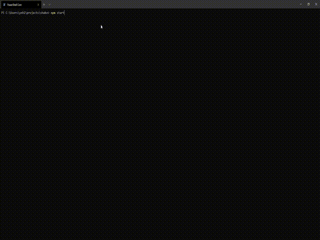

# Shake - Dashboard for Geeks



## Features

- Monitor the world's viral infections
- Show the latest news about viruses
- Pivot view of virus infection
- Rumors about the epidemic
- Get all above using geek's way

## Install

Prerequisite：
- Node.js v8+
- git installed

```
$ git clone https://github.com/sheencity/shake.git
$ cd shake
$ npm i
```

## Usage

```
$ npm start
```

And enjoy it!

## Related

- https://github.com/BlankerL/DXY-2019-nCoV-Crawler
- https://github.com/chjj/blessed
- https://github.com/sindresorhus/got